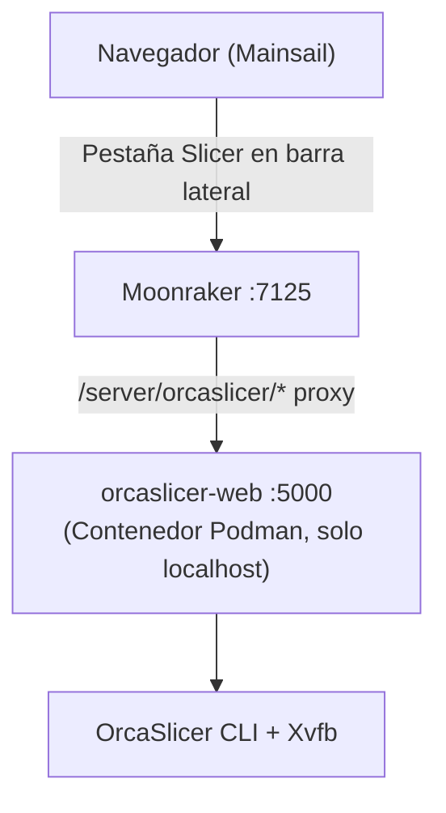

# Mainsail OrcaSlicer

¡Corta archivos STL y 3MF directamente desde Mainsail, sin necesidad de slicer de escritorio!

Este es un **componente de Moonraker** (no un fork de Mainsail) que añade la integración de OrcaSlicer a la interfaz web de Mainsail. Utiliza [orcaslicer-web](https://github.com/zvakanaka/orcaslicer-web) en el fondo y funciona con Mainsail estándar, sin necesidad de una compilación personalizada. Aparecerá una pestaña "Slicer" en la barra lateral de Mainsail donde podrás subir perfiles, arrastrar un modelo y cortarlo. El GCODE resultante llega automáticamente a tu lista de archivos GCODE.

> [!WARNING]
> Este proyecto está en etapas iniciales

## Arquitectura



- **Sin fork de Mainsail** — usa la navegación personalizada de Mainsail (`.theme/navi.json`)
- **Sin problemas CORS** — la UI del slicer es servida por Moonraker (mismo origen)
- **Sin dependencias externas** — la UI es un solo archivo HTML autocontenido

## Requisitos

- Board **aarch64** (p. ej. BIQU CB1, Raspberry Pi 4) o **x86_64** ejecutando Linux basado en Debian
- Klipper + Moonraker + Mainsail (instalación estándar KIAUH)
- Acceso a internet (para la compilación inicial del contenedor)
- ~15 GB de espacio en disco libre (se recomienda eMMC de 32 GB)

## Instalación

Conéctate por SSH a tu impresora y ejecuta:

```bash
git clone https://github.com/zvakanaka/mainsail-orcaslicer.git ~/mainsail-orcaslicer
bash ~/mainsail-orcaslicer/install.sh
```

El instalador maneja todo:

1. Instala Podman (si falta)
2. Clona y compila el contenedor orcaslicer-web
3. Inicia el contenedor en `127.0.0.1:5000` con un servicio systemd de usuario
4. Crea enlace simbólico del componente de Moonraker en su lugar
5. Añade la sección `[orcaslicer]` a `moonraker.conf`
6. Añade la entrada "Slicer" a la navegación de la barra lateral de Mainsail
7. Reinicia Moonraker y verifica que todo funciona

El script es idempotente, safe para ejecutar de nuevo. En mi experiencia tarda ~20-30 minutos.

## Uso

### 1. Exportar perfiles desde OrcaSlicer de escritorio

En tu portátil/escritorio, abre OrcaSlicer y exporta los perfiles configurados:

- **Impresora:** Menú Impresora > Exportar Configuración de Impresora
- **Proceso:** Menú Proceso > Exportar Configuración
- **Filamento:** Menú Filamento > Exportar Configuración

Cada uno produce un archivo `.json`.

### 2. Subir perfiles

Abre Mainsail y haz clic en **Slicer** en la barra lateral. Usa las pestañas de perfiles (Impresora / Proceso / Filamento) para subir cada archivo `.json`.

### 3. Cortar

1. Arrastra un archivo STL o 3MF al área de subida
2. Selecciona los perfiles de impresora, proceso y filamento de los menús desplegables
3. Haz clic en **Slice**
4. Cuando termine, el GCODE aparecerá en la pestaña **G-Code Files** de Mainsail
5. Imprime normal

## Qué se instala

| Ítem | Ubicación |
|------|-----------|
| Podman | Paquete del sistema |
| Código fuente orcaslicer-web | `~/orcaslicer-web/` |
| Imagen de contenedor | Almacenamiento local de Podman |
| Datos de perfiles | `~/orcaslicer-profiles/` |
| Servicio systemd de usuario | `~/.config/systemd/user/` |
| Componente de Moonraker | Enlace simbólico en el directorio de componentes de Moonraker |
| Sección de moonraker.conf | `~/printer_data/config/moonraker.conf` |
| Entrada de navegación Mainsail | `~/printer_data/config/.theme/navi.json` |

## Configuración

La sección `[orcaslicer]` en `moonraker.conf`:

```ini
[orcaslicer]
orcaslicer_url: http://localhost:5000
request_timeout: 300
gcodes_path: ~/printer_data/gcodes
```

## Actualizaciones

Se añade automáticamente una entrada `[update_manager]`. Las actualizaciones aparecen en el Administrador de Actualizaciones de Mainsail junto con Klipper y Moonraker.

Para actualizar manualmente por SSH en su lugar:

```bash
ssh <usuario>@<ip-o-hostname-de-la-impresora>

# En la impresora:
cd ~/mainsail-orcaslicer
git fetch origin
git reset --hard origin/main   # descarta cualquier cambio local, sobrescribe con latest main
bash install.sh                 # idempotente, safe para ejecutar sobre una instalación existente
```

## Pruebas

`install.sh` y `uninstall.sh` están cubiertos por una suite de pruebas bats-core que
simulan `apt-get`, `podman`, `systemctl`, `loginctl`, `curl`, `sudo`, y
`git`, luego ejecutan los scripts reales contra un `$HOME` aislado para ejercitar
su lógica real (idempotencia, detección de componentes moonraker, fusión de navi.json,
restricción por espacio en disco, etc.) sin tocar tu sistema.

`src/orcaslicer.py` (el componente de Moonraker) está cubierto por una suite pytest que
importa el archivo fuente real dentro de un paquete fake mínimo `moonraker`
(`tests/pyunit/fakemoonraker`), así que la lógica de proxy/validación/multipart se ejecuta
en verdad contra respuestas HTTP simuladas, sin necesidad de Moonraker o orcaslicer-web en vivo.

`src/slicer_ui.html` (el frontend) está cubierto por una suite Playwright que
serve el archivo real estáticamente e intercepta sus llamadas a `/server/orcaslicer/*`
ejercicio los flujos reales de subida/corte/borrado y lógica de control de botones
en un navegador real.

```bash
shellcheck install.sh uninstall.sh          # análisis estático

bats tests/unit                             # lógica install/uninstall (comandos simulados)

pip install -r tests/pyunit/requirements-test.txt
pytest tests/pyunit                         # lógica del componente orcaslicer.py

cd tests/frontend && npm install && npx playwright install --with-deps chromium
npx playwright test                         # frontend slicer_ui.html
```

`install.sh` y `uninstall.sh` también están cubiertos por un
arreglo de integración podman/systemd (`tests/integration`) que los ejecuta
en real (sin simulacros) dentro de un host anfitrión podman-anidado con systemd
 genuino como PID 1 — instalar, reinstalar (idempotencia), y desinstalar, cada uno seguido
de afirmaciones reales contra un contenedor `orcaslicer-web` construido
desde cero. Ver `tests/integration/README.md` para cómo ejecutarlo localmente; aún no está
conectado a CI (demasiado lento para por-push, planeado como trabajo nocturno/disparado por etiqueta).

## Solución de problemas

**"La pestaña 'Slicer'' no aparece"**
- Verifica que `~/printer_data/config/.theme/navi.json` exista
- Refresca el navegador (Ctrl+Shift+R)

**La página Slicer muestra "Offline"**
- Verifica el contenedor: `podman ps` y `podman logs orcaslicer-api`
- Verifica el servicio: `systemctl --user status container-orcaslicer-api`

**El corte falla**
- Verifica los logs del contenedor: `podman logs orcaslicer-api`
- Asegúrate de que los perfiles sean compatibles (misma versión de OrcaSlicer)

**El GCODE no aparece en la lista de archivos**
- Verifica los logs de Moonraker: `sudo journalctl -u moonraker -n 50`
- Verifica la ruta de gcodes: `ls ~/printer_data/gcodes/`

**La compilación del contenedor falla**
- Asegúrate de tener acceso a internet
- Verifica el espacio en disco: `df -h`
